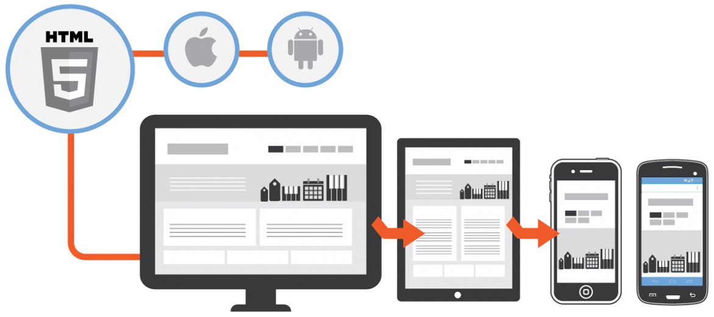

# Project Portfolio
This project was created to satisfy the requirements for completing Udacity's [Front-End Nanodegree](https://www.udacity.com/course/front-end-web-developer-nanodegree--nd001)

## Project Requirements

The goal of this project was to take a given design mock-up, and create a web page using HTML5 and CSS3. To complete the project, it had to meet specifications concerning design, responsiveness, separation of concerns, and code quality. Here are a few example specifications from the requirements document:

| Criteria      | Meets Specifications |
| ------------- | -------------------- |
| Semantic HTML | HTML5 semantic tags such as `<header>`, `<footer>`, `<article>`, `<section>` etc. are used to add meaning to the code. No `<div>` or `<section>` tags are without a CSS class or id. |
| Grid-Based Layout | Page utilizes a grid-based layout with styles making use of the `flexbox` layout or a framework like Bootstrap, Foundation, etc.If you're using Bootstrap or standard HMTL/CSS: the rows and columns of the grid must be wrapped in an element with a container class. |
| Cross-Device Compatibility | All content is responsive and displays on all display sizes. This includes: Desktop,  Google Nexus 5, Apple iPad. An image's associated title and text renders next to the image in all viewport sizes. |
| Styles Separated From HTML |  Portfolio completely separates structure (HTML) from design/style (CSS). There are no style attributes present in the body of the HTML document. There are no `<style>` elements in the document. |
| HTML Style Rules | <ul><li>HTML documents use HTML5 <!doctype html></li><li>Code passes HTML and CSS validators</li></ul> |
| CSS Style Rules | <ul><li>Code uses meaningful or generic ID and class names that are as short as possible but as long as necessary.</li><li>Code does not use element names in conjunction with IDs or classes.</li><li>Code uses shorthand properties where possible</li></ul> |

## Lessons learned
* Split the mock-up into columns and rows
* Bootstrap can expedite layout and can be customized
* HTML & CSS validators help to catch simple errors
* Using art direction to change images
```html
        <picture>
          <source srcset="images/responsive-design-sm.png" media="(max-width: 500px)">
            
        </picture>
```
